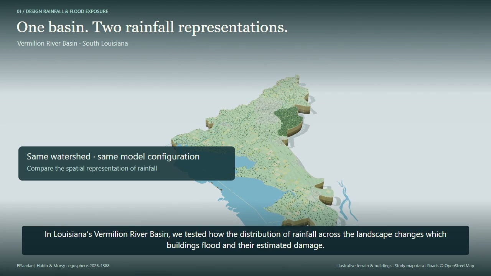

# Vermilion design storms

Python analysis scripts and the study video accompanying:

**Flood Exposure and Structure Damage under Deterministic Design-Storm and Stochastic Storm Transposition Rainfall Scenarios: A Case Study in South Louisiana, USA**

Mohamed ElSaadani, Emad Habib, and Mohamed M. Morsy

Accepted for publication in *Natural Hazards and Earth System Sciences* (NHESS). The [EGUsphere preprint](https://doi.org/10.5194/egusphere-2026-1388) is available under the earlier title *Effect of Design Storm Characterization on Flood Exposure and Structure Damage Estimates: A Case Study in South Louisiana, USA*.

The study compares flood exposure and estimated structure damage under NOAA Atlas 14 and stochastic storm transposition (SST) rainfall scenarios in the Vermilion River Basin, Louisiana.

## Study video

[](media/vermilion-design-storm-study.mp4)

[Watch or download the full video](media/vermilion-design-storm-study.mp4) · 3 min 33 s

## Code

| Script | Analysis |
| --- | --- |
| [Figure 4](src/figure04_depth_distributions.py) | Inundation-depth distributions and lognormal fits |
| [Figure 5](src/figure05_depth_damage_summary.py) | Flood depths, structure damage, and inundated-building counts |
| [Figure 6](src/figure06_sst_exclusive_exposure.py) | Buildings inundated under SST but not Atlas-14 |
| [Figure 7](src/figure07_kde_spatial_density.py) | Spatial density of inundated buildings |
| [Figure 9](src/figure09_hand_distributions.py) | Height Above Nearest Drainage (HAND) distributions |
| [Summary statistics](src/summary_statistics.py) | Depth and structure-damage summaries |

Install the Python packages:

```bash
python -m pip install -r requirements.txt
```

Each script contains descriptive input and output placeholders. Replace these with your own files, then run the script. Keep `_common.py` alongside the analysis scripts.

## Citation

ElSaadani, M., Habib, E., and Morsy, M. M. (2026). Effect of Design Storm Characterization on Flood Exposure and Structure Damage Estimates: A Case Study in South Louisiana, USA. *EGUsphere* [preprint]. [doi:10.5194/egusphere-2026-1388](https://doi.org/10.5194/egusphere-2026-1388).
